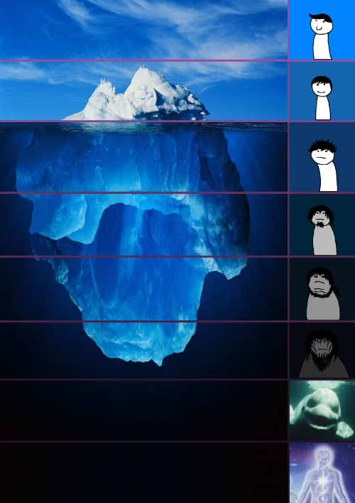

## Welcome


### Wifi

SSID: BRING Guest

Password: DontMakeTheOnionsCry

---

## Who are we?


We are a registered association in Zürich dedicated to software developers.

---

## What do we do?

- Coders Monthly
- SoCraTes Day
- Global Day of Coderetreat
- Software Craft Study Group
- Girl Coders get together
- Crafting Interpreters Book Study Group
- regular meetups

---


---

<div style="background-color: #fff;">


</div>

---

### Become a member today!


https://codersonly.org/verein/mitgliedschaft/

---


---

## This evening's goals

- Me being exposed to questions
- You learning at least something new

---

## Schedule

1. PhD Thesis by Eelco Dolstra

2. Brief overview of Nix concepts

3. Hands-on: Learning the Nix expression language

---

### The Purely Functional Software Deployment Model

by Eelco Dolstra

https://edolstra.github.io/pubs/phd-thesis.pdf

---


---

## Motivation for using Nix

...is that it solves one of the (subjectively) biggest issues in the software lifecycle.

---

- Dependencies
  - at build time
  - at run time
- Configuration
- Hardware
- ...

---

## Overview of Nix

- The Nix Store
- Nix Expressions
  - Nix Packages Collection
- Package Management
  - User Environments
- Store Derivations
- Deployment Models
  - Channels
- Transparent source/binary deployments

---



---

## Brief summary

---

- Nix _describes software components_ using a _functional expression language_.

- Nix _stores software components in isolation_ from each other in a central store _using unambiguous paths_.

- Nix _manages packages_ using the central store and _manipulating the user environment_.

---

## Where do I start?

Let's do some drawing!

---

## My approach

0. Learn the Nix expression language
1. Learn to describe environments with flakes
2. Learn to create your own derivations derivations
3. Start configuring your user environment using `home-manager`
4. Start configuring your system using NixOS

---

## Learning the language

...doing TDD on a problem we know!

---

## For those without Nix

```
$ sh <(curl -L https://nixos.org/nix/install) --daemon
```

For more information go to https://nixos.org/download/

---

# 👐🖥️

```
$ git clone https://github.com/escodebar/meetups.git
$ cd meetups && git checkout nix
$ ./test.sh
[PASS] 1/1 tests passed
```

---

...now pair and learn!

---

## Thank you!

---

and if you enjoyed this content... consider becoming a member


