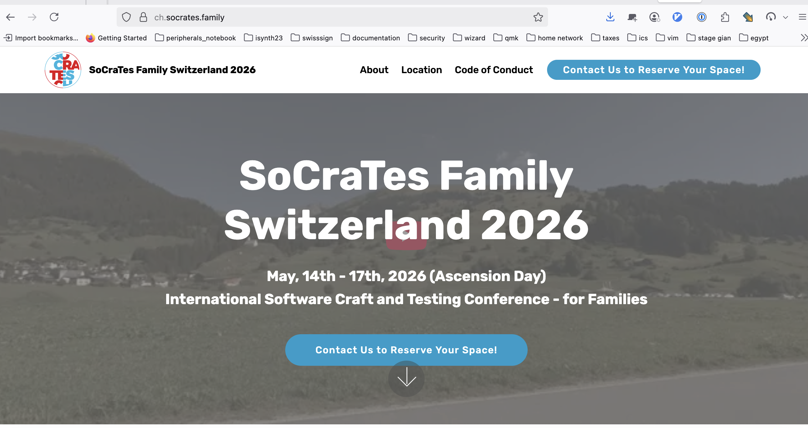

# Wifi: Weekly Special | 80975564
---

<!-- _class: centered -->


--

## Who are we?

# Coders Only

We are a registered association in Zürich dedicated to software developers.

---

# What do we do?

- SoCraTes Day CH
- Global Day of Coderetreat Bern & Zürich
- Book study groups (like Crafting Interpreters)
- Software Craft Study Group
- Girl Coders get together
- Coders Monthly
- Regular meetups

---

<!-- _class: sponsors -->

# Sponsoren

 
 
 

---

## Become a member

```shell
$ sh <(curl -L https://codersonly.org/members/join)
```

---

## hashtag: #SoCraTesZurich

---

# Practical points

- Toilets
- Drinks are sponsored by our host ergon
- Smoking corner

---

# Marketplace

Take post-its and write on them something

- you'd like to show
- you'd like to discuss
- you are curious about

pitch them (30 seconds) and find a slot on the board

---

# Rescheduling at the end

    - only with the permission of the owner of the session

# Sizing/Rooms:

all indicate with a dot their 6 favourite sessions
-> Possibility to change rooms


---

## Rules during the day and sessions

- Bumblebees and Butterflies - Learn, contribute or walk away.
- Law of 2 Feet - Go to a place where you can learn or share.
- Whoever comes are the right people.
- It starts when it starts. When it's over it's over.
- Aim for finishing 5 Minutes before the next session.

---

## Agenda

| Time     | Event                   |
|----------|-------------------------|
| 09       | Welcome and Marketplace |
| 10 to 13 | Sessions                |
| 13       | Lunch                   |
| 14 to 17 | Sessions                |
| 17       | Closing / Feedback      |
| 18       | Apéro                   |

---

# Have fun!!

---

<!-- _class: centered -->

# Global Day of Coderetreat

## Saturday, 8th November 2025


---

<!-- _class: sponsors -->

# Sponsoren

 
 
 

---

## Become a member

```shell
$ sh <(curl -L https://codersonly.org/members/join)
```

---

<!-- _class: centered -->

# January, 29th - February 1st, 2026


https://socrates-ch.org

---

<!-- _class: centered -->

# May, 14th - 17th, 2026



https://ch.socrates.family

---

## Join the cleanup session!

# 🧼✨🫧🧹🧽🗑️

(wipe boards, remove room labels, bring glassware into the cafeteria, rearrange chairs, etc.)
